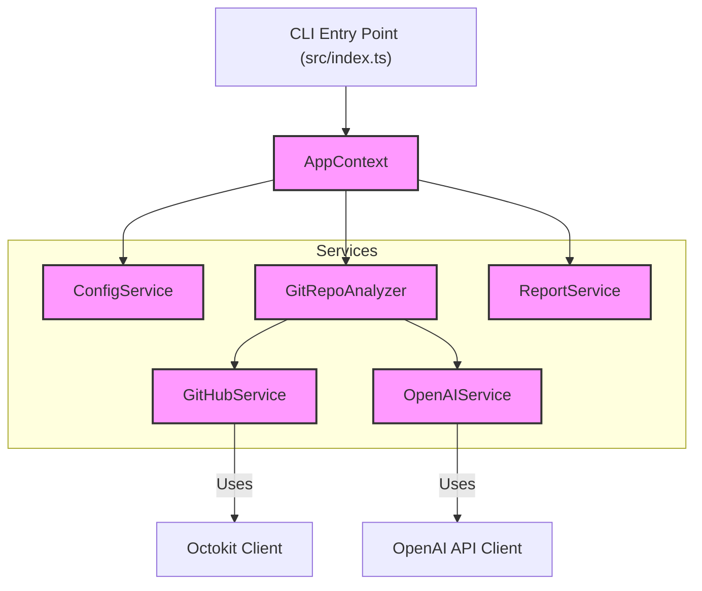
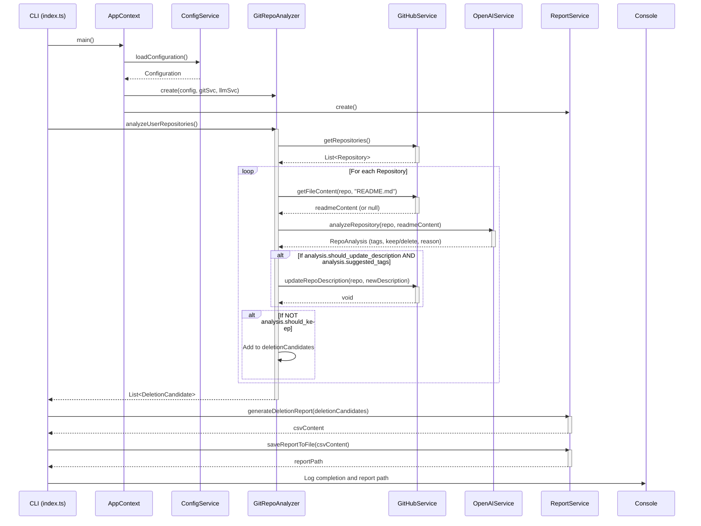

# GitHub Repository Analyzer Documentation

## 1. Overview

The GitHub Repository Analyzer is a command-line tool designed to help users manage their GitHub repositories. It fetches a list of repositories for a specified user, analyzes each repository's name, description, and README content using the OpenAI API, and then provides recommendations on whether to keep or delete the repository. Additionally, it can update repository descriptions with AI-generated tags and categories and generate a CSV report of repositories recommended for deletion.

The application is built with TypeScript and follows a service-oriented architecture to promote modularity and testability.

## 2. Architecture

### 2.1. Core Components

The system is composed of the following core services:

*   **`AppContext` (`src/index.ts`)**: Initializes and holds shared configurations and service instances. It orchestrates the overall application flow.
*   **`ConfigService` (`src/services/config.ts`)**: Responsible for loading and providing access to application configuration, primarily from environment variables (e.g., API keys, GitHub username).
*   **`GitHubService` (`src/services/github_service.ts`)**: Implements `IGitProvider`. Handles all interactions with the GitHub API, such as fetching repositories, retrieving README file content, and updating repository descriptions.
*   **`OpenAIService` (`src/services/openai_service.ts`)**: Implements `ILLMProvider`. Manages communication with the OpenAI API to perform analysis on repository data (name, description, README).
*   **`GitRepoAnalyzer` (`src/services/git_repo_analysis.ts`)**: The central orchestrator for the analysis process. It uses `GitHubService` to fetch repository data and `OpenAIService` to analyze it. It determines which repositories to keep or delete and which descriptions to update.
*   **`ReportService` (`src/services/report_service.ts`)**: Responsible for generating and saving reports, specifically the CSV report listing repositories recommended for deletion.

### 2.2. Component Diagram

## 3. Workflow

### 3.1. Main Sequence Diagram

The following diagram illustrates the typical sequence of operations when the application is run:

### 3.2. Workflow Steps

1.  **Initialization**:
    *   The CLI entry point (`src/index.ts`) starts the `main` function.
    *   `AppContext` is instantiated.
    *   `ConfigService` loads environment variables.
    *   `GitHubService`, `OpenAIService`, `GitRepoAnalyzer`, and `ReportService` are instantiated with necessary configurations and dependencies.

2.  **Repository Analysis (`GitRepoAnalyzer.analyzeUserRepositories`)**:
    *   `GitRepoAnalyzer` calls `GitHubService.getRepositories()` to fetch all repositories for the configured user.
    *   For each repository:
        *   It calls `GitHubService.getFileContent()` to fetch the README.md content.
        *   It calls `OpenAIService.analyzeRepository()` with the repository's name, description, and README content.
        *   The `OpenAIService` sends a prompt to the OpenAI API and parses the JSON response containing `should_keep`, `reason`, and `suggested_tags`.
        *   If the analysis suggests updating the description and provides tags, `GitRepoAnalyzer` calls `GitHubService.updateRepoDescription()`.
        *   If the analysis suggests not keeping the repository, it's added to a list of deletion candidates.

3.  **Report Generation**:
    *   After all repositories are analyzed, `GitRepoAnalyzer` returns the list of `DeletionCandidate` objects to the `main` function.
    *   The `main` function calls `ReportService.generateDeletionReport()` to create CSV content from the deletion candidates.
    *   It then calls `ReportService.saveReportToFile()` to save the CSV content to a timestamped file.

4.  **Completion**:
    *   The path to the saved report is logged to the console.

This documentation should provide a good overview of the project's structure and how it operates. Let me know if you'd like any adjustments or further details!
